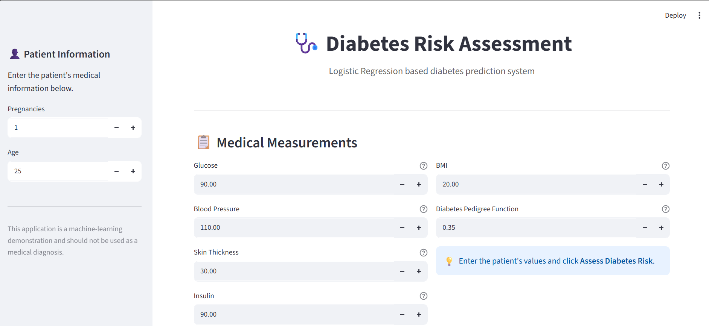
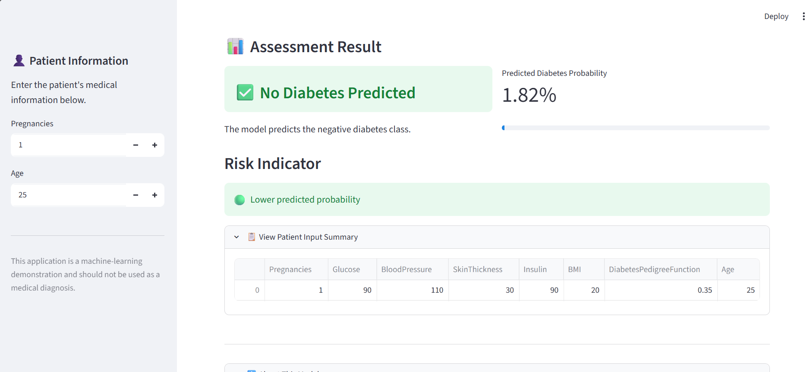

# 🩺 Diabetes Prediction Using Logistic Regression

<p align="center">
  
  
</p>

<p align="center">
  <b>Machine Learning Classification Project + Streamlit Deployment</b>
</p>

---

## 📌 Project Overview

This project uses **Logistic Regression** to predict whether a person is likely to have diabetes based on medical and demographic features.

The project covers the complete machine learning workflow:

> **Data Exploration → Data Preprocessing → Model Building → Evaluation → Interpretation → Streamlit Deployment**

---

## 🎯 Objective

The objective of this project is to build a **binary classification model** that predicts the diabetes outcome using patient medical information.

### Target Variable

| Value | Meaning     |
| ----- | ----------- |
| `0`   | No Diabetes |
| `1`   | Diabetes    |

---

## 📊 Dataset

The dataset contains the following features:

| Feature                  | Description                    |
| ------------------------ | ------------------------------ |
| Pregnancies              | Number of pregnancies          |
| Glucose                  | Plasma glucose concentration   |
| BloodPressure            | Diastolic blood pressure       |
| SkinThickness            | Triceps skin fold thickness    |
| Insulin                  | Serum insulin level            |
| BMI                      | Body Mass Index                |
| DiabetesPedigreeFunction | Diabetes hereditary risk score |
| Age                      | Age of the patient             |
| Outcome                  | Diabetes prediction target     |

---

## 🔍 Exploratory Data Analysis

The following EDA techniques were performed:

* Dataset structure and data types
* Summary statistics
* Missing-value checking
* Duplicate-value checking
* Histograms
* Box plots
* Pair plots
* Correlation analysis
* Correlation heatmap

The analysis was used to understand feature distributions, relationships, and correlations in the dataset.

---

## 🧹 Data Preprocessing

The following preprocessing steps were performed:

* Checked for missing values
* Checked for duplicate records
* Checked categorical variables
* Separated features and target
* Performed train-test split
* Standardized features using `StandardScaler`

The dataset contains numerical variables, so categorical encoding was not required.

---

## 🤖 Machine Learning Model

### Logistic Regression

**Logistic Regression** was used as the classification algorithm because the target variable contains two classes.

The model was trained using the standardized training data.

---

## 📈 Model Evaluation

The model was evaluated using:

* **Accuracy**
* **Precision**
* **Recall**
* **F1-Score**
* **ROC-AUC**

A **ROC curve** was also plotted to visualize the model's classification performance.

---

## 🔎 Model Interpretation

The Logistic Regression coefficients were analyzed to understand the contribution of individual features.

* Positive coefficients indicate an association with higher log-odds of diabetes.
* Negative coefficients indicate an association with lower log-odds of diabetes.
* Larger absolute standardized coefficients indicate a relatively stronger contribution to the model.

---

# 🌐 Streamlit Deployment

The trained model was deployed using **Streamlit**.

The application provides an interactive interface where users can enter patient information and obtain a prediction.

### 📝 Patient Data Input

Users can enter the patient's medical information through the Streamlit interface.

<p align="center">
  
</p>

### 🔮 Prediction Result

After entering the patient information and clicking the prediction button, the application displays the prediction and probability.

<p align="center">
  
</p>

---

## 🖥️ Run the Application Locally

### 1. Install dependencies

```bash
pip install -r requirements.txt
```

### 2. Run Streamlit

```bash
python -m streamlit run app.py
```

### 3. Open the application

Streamlit will provide a local URL such as:

```text
http://localhost:8501
```

---

## 📁 Project Structure

```text
Logistic-Regression-Diabetes-Prediction/
│
├── 📓 Logistical_regression.ipynb
├── 🐍 app.py
├── 📊 diabetes.csv
├── 🤖 logistic_regression_model.pkl
├── ⚙️ scaler.pkl
├── 📦 requirements.txt
├── 📖 README.md
│
└── 📸 screenshort/
    ├── data.png
    └── result.png
```

---

## 🛠️ Technologies Used

<p>
  
  
  
  
  
  
  
</p>

---

## 📚 Key Concepts Demonstrated

* Exploratory Data Analysis
* Data Preprocessing
* Binary Classification
* Logistic Regression
* Feature Scaling
* Train-Test Split
* Model Evaluation
* ROC-AUC
* ROC Curve
* Feature Coefficient Interpretation
* Streamlit Deployment

---

## 💡 Project Workflow

```text
                 ┌─────────────────┐
                 │   Diabetes Data │
                 └────────┬────────┘
                          ↓
                 ┌─────────────────┐
                 │      EDA        │
                 └────────┬────────┘
                          ↓
                 ┌─────────────────┐
                 │ Preprocessing   │
                 └────────┬────────┘
                          ↓
                 ┌─────────────────┐
                 │ Train/Test Split│
                 └────────┬────────┘
                          ↓
                 ┌─────────────────┐
                 │ Feature Scaling │
                 └────────┬────────┘
                          ↓
                 ┌─────────────────┐
                 │ Logistic        │
                 │ Regression      │
                 └────────┬────────┘
                          ↓
                 ┌─────────────────┐
                 │ Model Evaluation│
                 └────────┬────────┘
                          ↓
                 ┌─────────────────┐
                 │    Streamlit    │
                 │   Deployment    │
                 └─────────────────┘
```

---

## ⚠️ Disclaimer

This project is created for **educational and machine-learning demonstration purposes**. The predictions generated by the application should not be considered a medical diagnosis.
